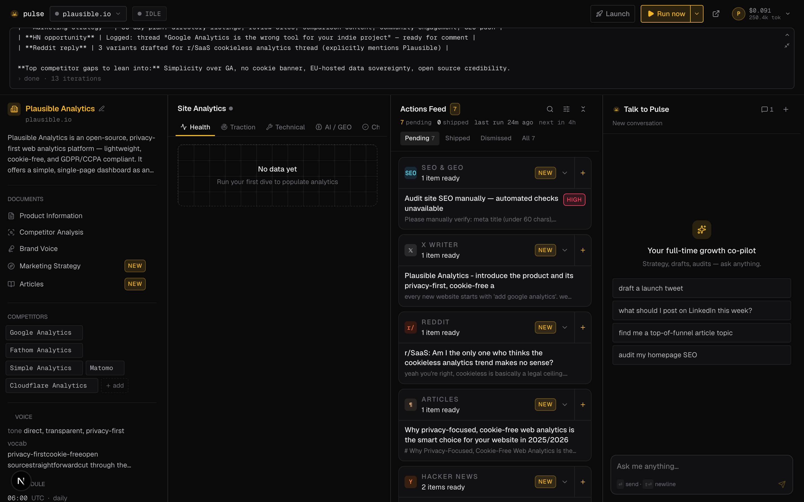
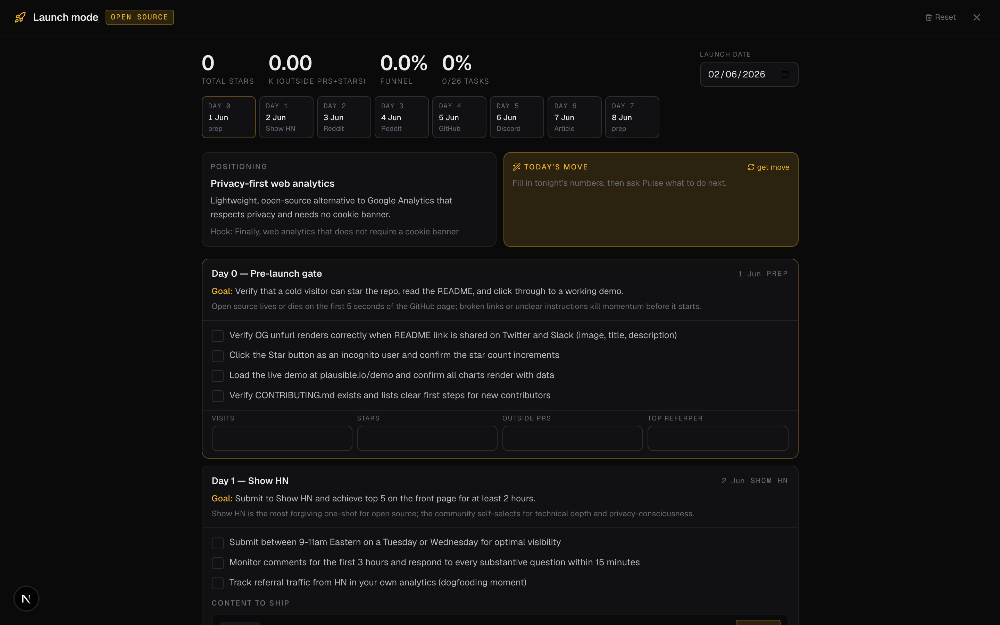
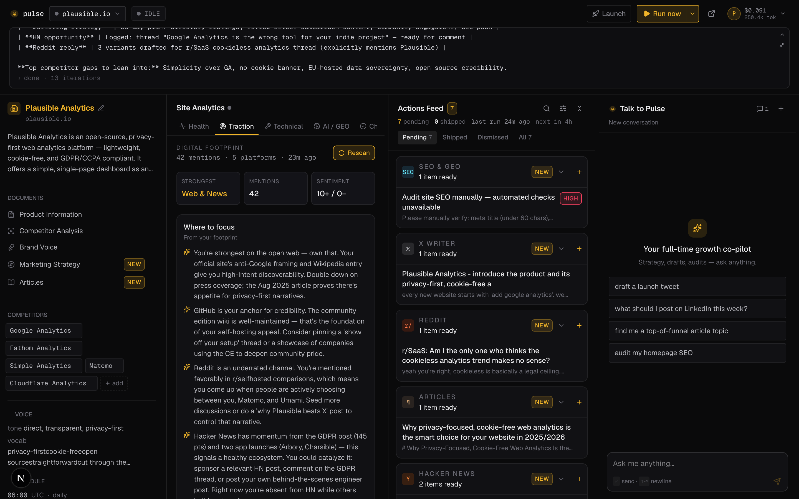
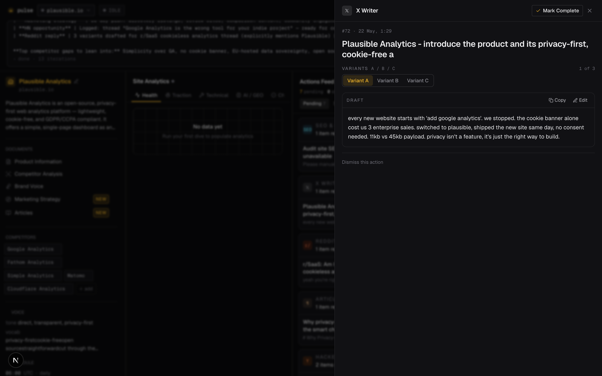

<div align="center">

# Pulse

**An open-source AI growth agent (CMO) for indie founders.**

Pulse wakes up, audits your site, finds where you're being talked about, scans Reddit and Hacker News for openings, drafts content in a real founder voice, and hands you a short daily action list. You spend ten minutes shipping; the agent does the legwork.

Runs on OpenAI-compatible models, so a daily pass costs cents.

</div>

<p align="center">
  
</p>

---

## What it does

Pulse is a self-hosted "AI CMO" for a single product (or several). Point it at a URL and it builds a working picture of the product, then keeps producing ready-to-ship marketing actions on a schedule.

- **First dive** — crawls the site, audits SEO + PageSpeed, extracts brand voice, drafts starter content across channels, writes a Product Information doc, and scans Reddit/HN for openings.
- **Daily runs** — a scheduled pass that surfaces 3-5 fresh, shippable actions.
- **Founder-voice drafting** — tweets, LinkedIn posts, Hacker News posts, blog articles, and Reddit replies written to sound like a real founder: no em-dashes, no emojis, no marketing fluff. Each draft comes as 3 A/B/C variants.
- **Smart Reddit discovery** — a 6-stage pipeline (profile → pain-point query plan → search → regex filter → LLM relevance verification → rank) that finds threads where your product genuinely fits, not just keyword matches.
- **Traction** — maps your digital footprint: searches the web, Reddit, and HN for your name/URL, classifies every mention by platform, and tells you where you're strong and where to focus.
- **Site audits** — Health (SEO + PageSpeed), **AI/GEO** (can ChatGPT/Claude/Perplexity/Gemini crawl + cite you? llms.txt, schema, answerable content), and **Links** (internal/external + broken links).
- **Launch mode** — classifies your product into a growth archetype and generates an archetype-driven Week-1 launch plan, with a live tracker (K-factor, funnel %, daily "today's move") and the actual posts to write each day, generated inline.
- **Per-channel generation** — a "+" on any action group to generate one tweet / Reddit reply / article / SEO audit on demand.
- **Scheduling + versioning** — set when and how often the daily pass runs (once/twice/custom). Each run snapshots a **version** with a day-over-day summary of what changed (new actions, SEO delta, traction delta), viewable as a timeline.
- **Multi-provider LLM** — configure any OpenAI-compatible providers with automatic failover, primary/secondary/vision roles, and per-token cost tracking, all from a settings panel.
- **Usage ledger** — every LLM operation (runs, per-channel gen, traction, launch, chat) is metered; the profile menu shows last-run and all-time token + cost totals.

## Screenshots

| Dashboard | Launch mode |
|---|---|
|  |  |

| Traction (digital footprint) | Action detail with A/B/C variants |
|---|---|
|  |  |

## Quick start

You'll need [uv](https://github.com/astral-sh/uv) (Python 3.12+) and Node 20+.

```bash
# 1. backend deps
uv sync

# 2. configure — copy the example env and add an API key
cp .env.example .env
#   set OPENADAPTER_API_KEY (or edit config.yaml to point at any
#   OpenAI-compatible provider — OpenAI, OpenRouter, Together, a local
#   Ollama/vLLM endpoint, etc.)

# 3. run the backend
uv run pulse                       # → http://127.0.0.1:8787

# 4. run the frontend (separate terminal)
cd web && npm install && npm run dev   # → http://localhost:3030
```

Open the dashboard, paste a product URL, and hit **First dive**. Watch the agent work live in the console; actions land in the feed as they're produced. You can also configure providers, run a traction scan, or open Launch mode from the header.

### One command

```bash
./run.sh            # installs deps on first run, then starts backend + frontend
./run.sh --setup-only   # just install
```

### Docker

```bash
cp .env.example .env      # add your provider key
docker compose up --build # → frontend on :3030, backend on :8787
```

The backend's SQLite db + settings persist in the `pulse-data` volume. The frontend proxies `/api/*` to the backend over the compose network; to point it at a backend elsewhere, rebuild with `--build-arg PULSE_BACKEND_URL=https://your-api`.

## Configuration

Providers and scheduling live in [`config.yaml`](config.yaml); secrets live in `.env`.

```yaml
llm:
  default_temperature: 0.6
  providers:
    - name: minimax
      base_url: https://api.openadapter.in/v1
      api_key_env: OPENADAPTER_API_KEY
      model: MiniMax-M2.5
      prompt_cost_per_million: 0.30        # for cost tracking only
      completion_cost_per_million: 1.20
    # add more — they're tried in order as failover

scheduler:
  enabled: true
  daily_hour: 6        # local time for the daily run

agent:
  max_iterations: 28
```

Providers can also be edited at runtime from the **Settings → Providers** panel in the UI (base URL, key, fetch available models, set primary/secondary/vision roles, test connection). Runtime edits are stored in `~/.pulse/settings.json` and override the YAML.

Any OpenAI-compatible endpoint works. Pulse defaults to [OpenAdapter](https://openadapter.dev) because it serves open-source models (MiniMax, GLM, DeepSeek, Qwen, …) cheaply, but you can point it at OpenAI, OpenRouter, Together, Groq, or a local Ollama/vLLM server.

## How it works

```
┌────────────────────────────────────────────────────────────────┐
│  Next.js 16 · React 19 · Tailwind 4   — :3030                   │
│  4-column dashboard · live agent console (SSE) · launch mode    │
│  rewrites /api/* → backend                                      │
└────────────────────────────┬────────────────────────────────────┘
                             │ REST + SSE
┌────────────────────────────▼────────────────────────────────────┐
│  FastAPI · Python 3.12   — :8787                                │
│  ├─ orchestrator: first_dive / daily / manual / targeted runs   │
│  ├─ agent loop: stream tokens → dispatch tools → repeat         │
│  ├─ launch + traction modules                                   │
│  ├─ APScheduler (daily cron per project)                        │
│  └─ SQLite store (projects, runs, actions, docs, launch)        │
└────────────────────────────┬────────────────────────────────────┘
              ┌──────────────┼───────────────┬──────────────┐
              ▼              ▼               ▼              ▼
        LLM provider     Web search /     Reddit JSON    HN Algolia
        (failover)       scrape           (public)       (public)
```

The agent is a ReAct-style loop: the model streams a response, Pulse dispatches any tool calls, feeds results back, and repeats until the model stops or hits the iteration cap. Every tool is a plain async function with a typed signature; the `@tool` decorator turns its docstring + type hints into an OpenAI function schema.

## Project layout

```
pulse.cc/
├── config.yaml                 # providers, scheduler, agent settings
├── src/pulse/
│   ├── server.py               # FastAPI app, SSE, scheduler, endpoints
│   ├── llm.py                  # multi-provider failover + usage tracking
│   ├── agent.py                # tool-calling loop with token streaming
│   ├── orchestrator.py         # run prompts + targeted-run playbook
│   ├── launch.py               # archetype table, plan + content generation
│   ├── traction.py             # digital-footprint scan
│   ├── versioning.py           # per-run snapshots + day-over-day summary
│   ├── tools/geo.py            # AI/GEO + link audits
│   ├── chat.py                 # chat agent + doc regeneration
│   ├── settings_store.py       # runtime provider config
│   ├── tools/                  # crawl, seo, web, discovery, drafting, reddit, …
│   └── store/actions.py        # SQLite, idempotent migrations
└── web/src/
    ├── app/                    # page, tokens.css (design system), globals
    ├── components/             # layout, actions, analytics, launch, settings, chat
    ├── hooks/useRunStream.ts   # SSE + polling fallback
    └── lib/api.ts              # typed client
```

## Adding a tool

```python
# src/pulse/tools/your_tool.py
from .registry import tool

@tool
async def my_tool(query: str, limit: int = 5) -> str:
    """One-line description the model reads to decide when to call this.

    Args:
        query: What to search for.
        limit: Max results (default 5).
    """
    ...
    return "result string the model sees"
```

Register it in `orchestrator.build_registry_for_run` and reference it from the relevant run prompt.

## Tech stack

- **Backend:** FastAPI, Python 3.12, SQLite, APScheduler, httpx, selectolax, tenacity
- **Frontend:** Next.js 16, React 19, Tailwind 4, TypeScript
- **Models:** any OpenAI-compatible chat-completions endpoint

## Contributing

Issues and PRs welcome — see [CONTRIBUTING.md](CONTRIBUTING.md). The codebase is intentionally small and readable; a good first contribution is a new tool or a new launch archetype.

## License

[MIT](LICENSE) © 2026 Arun K
